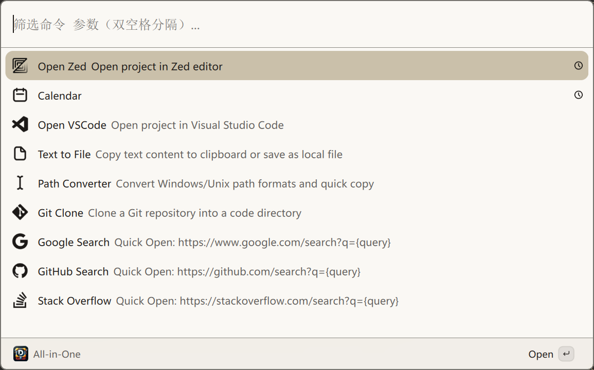

# DBox for Vicinae

一个基于 [Vicinae](https://github.com/vicinaehq/vicinae) 的工具箱插件。

## 预览

## 功能

| 功能           | 说明                                      |
| -------------- | ----------------------------------------- |
| Open VSCode    | 在 Visual Studio Code 中打开项目          |
| Open Zed       | 在 Zed 中打开项目                         |
| Text to File   | 将文本复制到剪贴板或保存为本地文件        |
| Path Converter | 转换 Windows 与 Unix 路径格式并快速复制   |
| Git Clone      | 将 Git 仓库克隆到配置的代码目录           |
| Calendar       | 查看包含农历、节气和法定节假日安排的日历  |
| Quick Open URL | 快速搜索 Google、GitHub 和 Stack Overflow |

开发：

- `pnpm dev`：连接正在运行的 Vicinae 进行开发
- `pnpm build`：构建并安装到本地 Vicinae 扩展目录
- `pnpm build:dist`：生成可分发的扩展到 `dist`
- `pnpm lint`：执行 Vicinae 扩展 lint

在 Vicinae 的扩展偏好设置中配置 `codeDir`。`codeDir` 支持以逗号分隔多个根目录。
